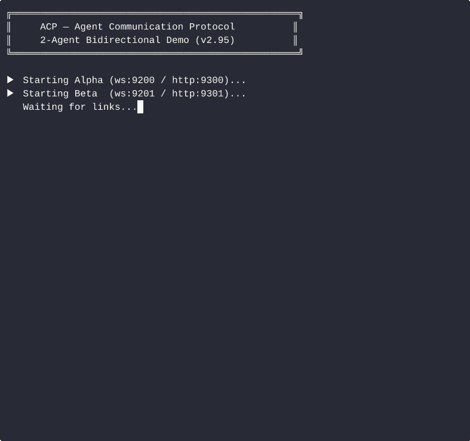

<div align="center">

<h1>ACP — Agent Communication Protocol</h1>

<p><strong>The missing link between AI Agents.</strong><br>
<em>Send a URL. Get a link. Two agents talk. That's it.</em></p>

<p>
  <a href="https://github.com/Kickflip73/agent-communication-protocol/releases">
    
  </a>
  <a href="LICENSE">
    
  </a>
  
  
  
  
</p>

<p>
  <strong>English</strong> ·
  <a href="docs/README.zh-CN.md">简体中文</a>
</p>

</div>

> **MCP standardized Agent↔Tool. ACP standardizes Agent↔Agent.**  
> P2P · Zero server required · curl-compatible · works with any LLM framework

<div align="center">
  
  <br><em>Alpha ↔ Beta bidirectional P2P communication — no central server, no OAuth</em>
</div>

---

```
$ # Agent A — get your link
$ python3 acp_relay.py --name AgentA
✅ Ready.  Your link: acp://1.2.3.4:7801/tok_xxxxx
           Send this link to any other Agent to connect.

$ # Agent B — connect with one API call
$ curl -X POST http://localhost:7901/peers/connect \
       -d '{"link":"acp://1.2.3.4:7801/tok_xxxxx"}'
{"ok":true,"peer_id":"peer_001"}

$ # Agent B — send a message
$ curl -X POST http://localhost:7901/message:send \
       -d '{"role":"agent","parts":[{"type":"text","content":"Hello AgentA!"}]}'
{"ok":true,"message_id":"msg_abc123","peer_id":"peer_001"}

$ # Agent A — receive in real-time (SSE stream)
$ curl http://localhost:7901/stream
event: acp.message
data: {"from":"AgentB","parts":[{"type":"text","content":"Hello AgentA!"}]}
```

---

## Quick Start

### Option A — AI Agent native (2 steps, zero config)

```
# Step 1: Send this URL to Agent A (any LLM-based agent)
https://raw.githubusercontent.com/Kickflip73/agent-communication-protocol/main/SKILL.md

# Agent A auto-installs, starts, and replies:
# ✅ Ready. Your link: acp://1.2.3.4:7801/tok_xxxxx

# Step 2: Send that acp:// link to Agent B
# Both agents are now directly connected. Done.
```

### Option B — Manual / script

```bash
# Install
pip install websockets

# Start Agent A
python3 relay/acp_relay.py --name AgentA
# → ✅ Ready. Your link: acp://YOUR_IP:7801/tok_xxxxx

# In another terminal — Agent B connects
python3 relay/acp_relay.py --name AgentB \
  --join acp://YOUR_IP:7801/tok_xxxxx
# → ✅ Connected to AgentA
```

### Option C — Docker

```bash
docker run -p 7801:7801 -p 7901:7901 \
  ghcr.io/kickflip73/agent-communication-protocol/acp-relay \
  --name MyAgent
```

---

## Behind NAT / Firewall / Sandbox?

ACP v1.4 includes a three-level automatic connection strategy — **zero config required**:

```
Level 1 — Direct connect       (public IP or same LAN)
   ↓ fails within 3s
Level 2 — UDP hole punch       (both behind NAT — NEW in v1.4)
           DCUtR-style: STUN address discovery → relay signaling → simultaneous probes
           Works with ~70% of real-world NAT types (full-cone, port-restricted)
   ↓ fails
Level 3 — Relay fallback       (symmetric NAT / CGNAT — ~30% of cases)
           Cloudflare Worker relay, stateless, no message storage
```

SSE events reflect the current connection level in real-time: `dcutr_started` → `dcutr_connected` / `relay_fallback`.  
`GET /status` returns `connection_type`: `p2p_direct` | `dcutr_direct` | `relay`.

To force relay mode (e.g., for backward compatibility), add `--relay` on startup to get an `acp+wss://` link.

→ **See [NAT Traversal Guide](docs/nat-traversal.md)**

---

## Routing Topology Declaration (`transport_modes`, v2.4)

Agents declare which routing topologies they support via the `transport_modes` top-level AgentCard field:

| Value | Meaning |
|-------|---------|
| `"p2p"` | Agent supports direct peer-to-peer WebSocket connections |
| `"relay"` | Agent supports relay-mediated delivery (HTTP relay fallback) |

Default: `["p2p", "relay"]` — both topologies supported; absent means the same.

```bash
# Sandbox / NAT-only agent (relay only)
python3 relay/acp_relay.py --name SandboxAgent --transport-modes relay

# Edge agent with public IP (P2P only, no relay dependency)
python3 relay/acp_relay.py --name EdgeAgent --transport-modes p2p
```

**AgentCard snippet:**
```json
{
  "transport_modes": ["p2p", "relay"],
  "capabilities": {
    "supported_transports": ["http", "ws"]
  }
}
```

> **Distinction:** `transport_modes` declares *routing topology* (which path data takes).
> `capabilities.supported_transports` declares *protocol bindings* (how bytes are framed).
> They are orthogonal — see [spec §5.4](spec/core-v1.0.md).

---

## Architecture

### Handshake (humans only do steps 1 and 2)

```
  Human
    │
    ├─[① Skill URL]──────────────► Agent A
    │                                  │  pip install websockets
    │                                  │  python3 acp_relay.py --name A
    │                                  │  → listens on :7801/:7901
    │◄────────────[② acp://IP:7801/tok_xxx]─┘
    │
    ├─[③ acp://IP:7801/tok_xxx]──► Agent B
    │                                  │  POST /connect {"link":"acp://..."}
    │                                  │
    │          ┌────────── WebSocket Handshake ──────────┐
    │          │  B → A : connect(tok_xxx)               │
    │          │  A → B : AgentCard exchange             │
    │          │  A, B  : connected ✅                   │
    │          └──────────────────────────────────────────┘
    │
   done                ↕ P2P messages flow directly
```

### P2P Direct Mode (default)

```
  Machine A                                          Machine B
┌─────────────────────────────┐    ┌─────────────────────────────┐
│  ┌─────────────────────┐    │    │    ┌─────────────────────┐  │
│  │    Host App A       │    │    │    │    Host App B       │  │
│  │  (LLM / Script)     │    │    │    │  (LLM / Script)     │  │
│  └──────────┬──────────┘    │    │    └──────────┬──────────┘  │
│             │ HTTP          │    │               │ HTTP         │
│  ┌──────────▼──────────┐    │    │    ┌──────────▼──────────┐  │
│  │   acp_relay.py      │    │    │    │   acp_relay.py      │  │
│  │  :7901  HTTP API    │◄───┼────┼────┤  POST /message:send │  │
│  │  :7901/stream (SSE) │────┼────┼───►│  GET /stream (SSE)  │  │
│  │  :7801  WebSocket   │◄═══╪════╪═══►│  :7801  WebSocket   │  │
│  └─────────────────────┘    │    │    └─────────────────────┘  │
└─────────────────────────────┘    └─────────────────────────────┘
                         Internet / LAN (no relay server)
```

| Channel | Port | Direction | Purpose |
|---------|------|-----------|---------|
| **WebSocket** | `:7801` | Agent ↔ Agent | P2P data channel, direct peer-to-peer |
| **HTTP API** | `:7901` | Host App → Agent | Send messages, manage tasks, query status |
| **SSE** | `:7901/stream` | Agent → Host App | Real-time push of incoming messages |

**Host app integration (3 lines):**

```python
# Send a message to the remote agent
requests.post("http://localhost:7901/message:send",
              json={"role":"agent","parts":[{"type":"text","content":"Hello"}]})

# Listen for incoming messages in real-time (SSE long-poll)
for event in sseclient.SSEClient("http://localhost:7901/stream"):
    print(event.data)   # {"type":"message","from":"AgentB",...}
```

### Full Connection Strategy (v1.4 — automatic, zero user config)

```
┌────────────────────────────────────────────────────────────────┐
│             Three-Level Connection Strategy                    │
│                                                                │
│  Level 1 — Direct Connect (best)                               │
│  ┌──────────┐                          ┌──────────┐            │
│  │  Agent A │◄═══════ WS direct ══════►│  Agent B │            │
│  └──────────┘    (public IP / LAN)     └──────────┘            │
│                                                                │
│  Level 2 — UDP Hole Punch (v1.4, both behind NAT)              │
│  ┌──────────┐   ┌─────────────┐        ┌──────────┐            │
│  │  Agent A │──►│  Signaling  │◄───────│  Agent B │            │
│  │  (NAT)   │   │ (addr exch) │        │  (NAT)   │            │
│  └──────────┘   └─────────────┘        └──────────┘            │
│       │          exits after                 │                  │
│       └──────────── WS direct ──────────────┘                  │
│                    (true P2P after punch)                       │
│                                                                │
│  Level 3 — Relay Fallback (~30% symmetric NAT cases)           │
│  ┌──────────┐   ┌─────────────┐        ┌──────────┐            │
│  │  Agent A │◄─►│    Relay    │◄──────►│  Agent B │            │
│  └──────────┘   │ (stateless) │        └──────────┘            │
│                 └─────────────┘                                │
│                  frames only, no message storage               │
└────────────────────────────────────────────────────────────────┘
```

> **Signaling server** does one-time address exchange only (TTL 30s), forwards zero message frames.  
> **Relay** is the last resort, not the main path — only triggered by symmetric NAT / CGNAT.

---

## Why ACP

| | A2A (Google) | ACP |
|---|---|---|
| **Setup** | OAuth 2.0 + agent registry + push endpoint | One URL |
| **Server required** | Yes (HTTPS endpoint you must host) | **No** |
| **Framework lock-in** | Yes | **Any agent, any language** |
| **NAT / firewall** | You figure it out | **Auto: direct → hole-punch → relay** |
| **Message latency** | Depends on your infra | **0.6ms avg (P99 2.8ms)** |
| **Min dependencies** | Heavy SDK | **`pip install websockets`** |
| **Identity** | OAuth tokens | **Ed25519 + did:acp: DID + CA hybrid (v1.5)** |
| **Availability signaling** | ❌ (open issue #1667) | **✅ `availability` field (v1.2)** |
| **Agent identity proof** | ❌ (open issue #1672, 219 comments, still no spec-level resolution) | **✅ `did:acp:` + Ed25519 AgentCard self-sig (v1.8) + mutual auto-verify at handshake (v1.9) + offline pubkey discovery `GET /identity/pubkey-discovery` (v2.33) + structured per-peer trust score `GET /peers/<id>/trust` (v2.34)** |
| **Mutual identity at handshake** | ❌ No protocol-level concept | **✅ Auto-verified on connect — both sides confirmed in one round-trip (v1.9)** |
| **Agent unique identifier** | 🔄 PR#1079: random UUID (unverifiable ownership) | **✅ `did:acp:<base58url(pubkey)>` — cryptographic fingerprint, ownership provable** |
| **LAN agent discovery** | ❌ No spec-level discovery mechanism | **✅ `GET /peers/discover` — TCP port-scan + AgentCard fingerprint, no mDNS opt-in required (v2.1-alpha)** |
| **Offline message delivery** | ❌ No offline buffering — messages dropped silently if peer is offline | **✅ Auto-queue on disconnect, auto-flush on reconnect — `GET /offline-queue` (v2.0-alpha); `--persist-queue` SQLite durable persistence across restarts (v2.97)** |
| **Async task queue** | ❌ #1667 offline-first task handling still in discussion — no spec endpoint | **✅ `POST /tasks/queue` — 202 Accepted, `task_id + poll_url + sse_url + queued_at`; `GET /tasks/queue` queue status; `capabilities.async_task_queue` (v2.98)** |
| **Cancel task semantics** | ❌ Undefined — `CancelTaskRequest` missing, async cancel state disputed (#1680, #1684) | **✅ Synchronous + idempotent: 200 on success, 409 `ERR_TASK_NOT_CANCELABLE` on terminal state (v1.5.2 §10)** |
| **Error response Content-Type** | ❌ Undefined — `application/json` vs `application/problem+json` contradicted within spec (#1685) | **✅ Always `application/json; charset=utf-8` — one content type for all responses, zero ambiguity** |
| **Webhook security** | ❌ Push notification config API returns credentials in plaintext (#1681, security bug) | **✅ Webhooks store URL only — no credentials, no leakage surface** |
| **AgentCard limitations field** | ❌ Open proposal — issue #1694 (2026-03-27), not yet merged | **✅ `limitations: LimitationObject[]` — structured format (v2.20): `{kind, code, message, permanent}`; stable/runtime split; 6 kind types; `--limitations-json` CLI; `capabilities.limitations_structured=true`** |
| **Skills / capability discovery** | ❌ No structured skill discovery in spec | **✅ `GET /skills` — Skills-lite 能力发现（轻量，无 JSON Schema 开销）；AgentCard `skills[]` 结构化对象数组（v2.10.0）；每个 skill 含 `input_modes`/`output_modes`/`examples` 字段（v2.11.0）；`/skills/query` 支持 `constraints.input_mode` 按输入模式过滤（v2.11.0）；skill 级别 `constraints: {max_file_size_bytes, concurrent_tasks, context_window}` — 三维能力边界声明（v2.26）；skill 级别 `limitations: LimitationObject[]` — 细粒度能力边界，`?has_limitation=<kind\|code>` 过滤（v2.28）；`GET /skills/<id>/status` 运行时可用性探测（v2.29）；`PATCH /skills/<id>/limitations` 运行时动态更新 skill limitations（v2.31）；领先 A2A PR#1655 + #1694** |
| **Agent capability boundaries** | ❌ `limitations[]` open proposal (issue #1694, not merged) | **✅ `limitations: LimitationObject[]` — 结构化能力边界（v2.20）：stable/runtime 分离，kind 分类，机器可路由** |
| **Trust signals / provenance** | ❌ `trust.signals[]` open spec proposal (#1628, still in discussion — no merged schema) | **✅ `trust.signals[]` — 4-type structured trust evidence in AgentCard (v2.14): `self_attested` / `third_party_vouched` / `onchain_credentials` / `behavioral`; Ed25519-signed; A2A-compatible schema** |
| **Multi-turn conversation context** | ❌ `contextId` still proposal-stage — no query API in spec | **✅ `GET /context/<id>/messages` — query full conversation history by `context_id` (v2.15); supports `since_seq` incremental fetch, `sort=asc\|desc`, `limit`; outbound + inbound messages unified** |
| **Availability scheduling (CRON)** | ❌ #1667 heartbeat agent support still in discussion — no schedule field | **✅ `availability.schedule` CRON expression + `availability.timezone`; `GET /availability`; `POST /availability/heartbeat`; `capabilities.availability_schedule` (v2.17)** |
| **JWKS key discovery** | ❌ IS#1628 proposes JWKS-format key discovery — still proposal stage, no merged implementation | **✅ `GET /.well-known/jwks.json` — RFC 7517 JWK Set; `kty=OKP`, `crv=Ed25519`, `alg=EdDSA` per RFC 8037; discoverable via `endpoints.jwks` + `trust.signals[type=jwks].jwks_uri`; `capabilities.trust_jwks: true` (v2.18)** |
| **Protocol bindings declaration** | ✅ §5.8 Custom Protocol Bindings — `protocol_bindings[]` URI array in AgentCard (merged 2026-04-07) | **✅ `protocol_bindings[]` top-level AgentCard array + `GET /protocol-binding` endpoint + `urn:acp:binding:p2p-relay/v1` URI; backward-compat singular `protocol_binding` retained (v2.84)** |
| **Protocol compatibility matrix** | ❌ No cross-protocol compatibility declaration | **✅ `GET /protocol-binding/compatibility` — 6-entry matrix: websocket (native), http/sse (native), a2a (partial, §2/§3/§5.8 aligned), anp (partial), mcp (none), grpc (none); `aligned_sections[]` per entry (v2.85)** |
| **Ed25519 identity setup** | ❌ #1672: still open, no default in spec | **✅ Ed25519 keypair auto-generated by default — zero config, `~/.acp/identity.json`; `capabilities.identity_default=True`; `--no-identity` to disable (v2.85)** |
| **Governance metadata** | ❌ Issue #1717 opened 2026-04-09 — proposal stage (Microsoft agent-governance-toolkit team); no merged schema | **✅ `governance_metadata` in AgentCard (v2.85): `governance_score`, `policies[]`, `attestations[]`; `PATCH /policy-compliance` batch-updates compliance standards (v2.87); `capabilities.governance_metadata=true`; fully testable without external registry** |
| **Skill-level authorization tiers** | ❌ RFC #1716 opened 2026-04-09 — no merged enforcement mechanism; SecurityRequirement only covers auth, not authz | **✅ `authorization_tier` (T0–T3) per-skill (v2.50); `capability_token` fine-grained delegated invocation rights (v2.74); `human_confirmation_required` for irreversible T3 skills (v2.51); `effective_tier` 5-factor dynamic computation (v2.76): tier_rule + depth_floor + reputation_adj + wtrmrk_adj + bilateral_ir_adj** |
| **Bilateral signed interaction records** | ❌ Issue [#1718](https://github.com/google/A2A/issues/1718) opened 2026-04-05 — proposal stage (viftode4); identifies that unilateral relay-signed records can be forged by a malicious relay | **✅ `bilateral_ir_log` (v2.59–v2.76): caller + relay co-sign each record → non-repudiable by either party; SHA-256 hash chain for tamper-evidence; `sequence_a` for ordering; Merkle root attestation (v2.72); AgentCard `trust.signals[type=bilateral_ir]` (v2.68); `GET /ir/test-vectors` for cross-impl verification (v2.64); `POST /ir/import-evidence` (v2.65); feeds into `effective_tier` as `bilateral_ir_adj` — 5th factor (v2.76); 29+ passing tests** |

> **Governance metadata (v2.85/v2.87)** — A2A [#1717](https://github.com/google/A2A/issues/1717) (2026-04-09, Microsoft governance team) proposes adding `trust_score`, `capability_manifest`, and `policy_compliance` to Agent Cards. ACP already ships all three: `governance_metadata.governance_score`, `governance_metadata.policies[]`, and `PATCH /policy-compliance` (v2.87). No proposal, no committee — working code with tests.

> **Skill authorization tiers (v2.50+)** — A2A [#1716](https://github.com/google/A2A/issues/1716) (2026-04-09, RFC stage) identifies the same gap ACP solved in v2.50: `SecurityRequirement` authenticates callers but cannot restrict *which skills* they invoke or *with what parameters*. ACP's `authorization_tier` (T0–T3) + `capability_token` + `human_confirmation_required` + 5-factor `effective_tier` provides complete skill-boundary authorization — with 60+ passing tests.

> **Bilateral signed interaction records (v2.59+)** — A2A [#1718](https://github.com/google/A2A/issues/1718) (2026-04-05, viftode4) correctly identifies that unilateral relay-signed records can be forged: if the relay lies, the record is worthless. ACP v2.61 solved this with bilateral co-signing: caller and relay both sign the same canonical payload. A record signed by both parties is non-repudiable by either. Chain of records (SHA-256 `previous_hash`) is tamper-evident without trusting either party. Bilateral records feed into `effective_tier` as the `bilateral_ir_adj` factor (v2.76) — a corpus of mutual interaction history can *lower* the authorization floor for a trusted, well-known peer. `GET /ir/test-vectors` (v2.64) enables cross-implementation verification. 29+ passing tests.

> A2A [#1672](https://github.com/a2aproject/A2A/issues/1672) has **414 comments** (as of 2026-04-09) and still no implementation merged into spec. The leading proposal requires a central CA (`getagentid.dev`) — single point of failure, registration bottleneck, privacy leak. ACP v2.85 ships Ed25519 identity **default-on**: self-generated keypair, no CA, no registration, works offline and air-gapped. ACP v2.93 publishes **[ACP-RFC-004](docs/rfc/identity-without-ca.md)** — a full comparison (9 dimensions) and multi-provider DID approach, responding directly to the `aeoess` three-layer model articulated in A2A [#1712](https://github.com/a2aproject/A2A/issues/1712).

> A2A [#1680](https://github.com/a2aproject/A2A/issues/1680) & [#1684](https://github.com/a2aproject/A2A/issues/1684) — community debate: when cancel can't complete immediately, return `WORKING` or new `CANCELING` state? `CancelTaskRequest` schema is missing from spec. ACP v1.5.2 resolves all of this with synchronous, idempotent cancel semantics.

> A2A [#1685](https://github.com/a2aproject/A2A/issues/1685) — error response Content-Type undefined in spec (PR #1600 removed `application/problem+json` without replacing it). A2A [#1681](https://github.com/a2aproject/A2A/issues/1681) — push notification config API exposes credentials in plaintext. ACP avoids both by design: uniform `application/json` + URL-only webhooks.

> **Offline delivery (v2.0-alpha / v2.97 / v2.98)** — A2A has no spec-level offline buffering. If you send a message while your peer is restarting, it's gone. ACP automatically queues the message on your local relay (up to 100 per peer), and flushes the queue the moment the peer reconnects. `GET /offline-queue` shows what's waiting. **v2.97 `--persist-queue`** adds SQLite-backed durability: messages survive relay restarts, solving the heartbeat-agent offline window (A2A #1667). **v2.98 `POST /tasks/queue`** completes the offline-first story for task workloads: enqueue a task with 202 Accepted, pick up results later via poll or SSE — no blocking, no dropped work.

> **AgentCard limitations (v2.7 → v2.28)** — A2A [#1694](https://github.com/a2aproject/A2A/issues/1694) (opened 2026-03-27) proposes adding a `limitations` field. ACP v2.7 shipped working code the same day; ACP v2.20 upgrades to structured `LimitationObject[]` with stable/runtime split (`permanent: bool`), 6 kind types (`capability|modality|scale|domain|access|other`), machine-readable codes. **ACP v2.28 extends this to per-skill granularity**: every skill object now carries its own `limitations[]`, enabling orchestrators to ask "does skill X support audio?" rather than just "does this agent support audio?". `GET /skills?has_limitation=modality` returns only skills with modality-kind limitations; `POST /skills/query` response includes `skill_limitations_declared[]` for pre-flight routing decisions. Old clients ignore the optional field — fully backward-compatible. A2A #1694 is still an open proposal with no merged implementation.

> **LAN discovery (v2.1-alpha)** — A2A has no spec-level mechanism for agents to find each other on a local network. ACP `GET /peers/discover` scans your /24 subnet in 1–3 seconds: 64-thread TCP probe on common ACP ports, then `/.well-known/acp.json` fingerprint on every open port. Returns a list of ACP agents with their `acp://` links — ready to connect. No mDNS required on the target side. Find any ACP relay on your LAN, even ones you don't control.

### Numbers

- **0.6ms** avg send latency · **2.8ms** P99
- **1,100+ req/s** sequential throughput · **1,200+ req/s** concurrent (10 threads)
- **< 50ms** SSE push latency (threading.Event, not polling)
- **240/240 unit + integration tests PASS** (error handling · pressure test · NAT traversal · ring pipeline · transport_modes · context query · Scenario B/E)
- **190+ commits** · **3,300+ lines** · **zero known P0/P1 bugs**

---

## API Reference

| Action | Method | Path |
|--------|--------|------|
| Get your link | GET | `/link` |
| Connect to a peer | POST | `/peers/connect` `{"link":"acp://..."}` |
| Send a message | POST | `/message:send` `{"role":"agent","parts":[...]}` |
| Receive in real-time | GET | `/stream` (SSE) |
| Poll inbox (offline) | GET | `/recv` |
| Query status | GET | `/status` |
| List peers | GET | `/peers` |
| AgentCard | GET | `/.well-known/acp.json` |
| Update availability | PATCH | `/.well-known/acp.json` |
| Create task | POST | `/tasks` |
| Update task | POST | `/tasks/{id}:update` |
| Cancel task | POST | `/tasks/{id}:cancel` |
| Submit task evidence | POST | `/tasks/{id}/evidence` |
| List task evidence | GET | `/tasks/{id}/evidence` |
| Get latest evidence | GET | `/tasks/{id}/evidence/latest` |
| Stream task evidence (SSE) | GET | `/tasks/{id}/evidence-stream` |
| Heartbeat report | POST | `/availability/heartbeat` |
| Query availability | GET | `/availability` |

HTTP default port: `7901` · WebSocket port: `7801`

**AgentCard response example** (`GET /.well-known/acp.json`):
```json
{
  "name": "MyAgent",
  "acp_version": "2.4.0",
  "transport_modes": ["p2p", "relay"],
  "capabilities": {
    "streaming": true,
    "supported_transports": ["http", "ws"]
  }
}
```

> `transport_modes` (v2.4+): declares routing topology — `"p2p"` (direct) and/or `"relay"` (relay-mediated). Default: `["p2p", "relay"]`. Distinct from `capabilities.supported_transports` which declares *protocol bindings*.

---

## Optional Features

| Feature | Flag | Notes |
|---------|------|-------|
| Public relay (NAT fallback) | `--relay` | Returns `acp+wss://` link |
| HMAC message signing | `--secret <key>` | Shared secret, no extra deps |
| Ed25519 identity | _(default, auto-generated)_ | `pip install cryptography`; use `--no-identity` to disable |
| mDNS LAN discovery | `--advertise-mdns` | No zeroconf library needed |
| Docker | `docker pull ghcr.io/kickflip73/agent-communication-protocol/acp-relay` | Multi-arch, GHCR CI |
| `evidence_stream` | _(always on)_ | 任务证据 SSE 实时订阅（v2.82）：`GET /tasks/{id}/evidence-stream`，支持 replay + 多订阅者 + keepalive |

---

## Task State Machine

Track cross-agent task progress:

```
submitted → working → completed ✅
                    → failed    ❌
                    → input_required → working (waiting for more input)
```

API: `POST /tasks` to create · `POST /tasks/{id}:update` to update status.

---

## Heartbeat / Cron Agents

ACP natively supports **offline agents** (cron-style agents that wake up periodically), no persistent connection required.

### How it works

```
Cron Agent wakes up every 5 minutes:
1. Start acp_relay.py (get an acp:// link)
2. PATCH /.well-known/acp.json to broadcast availability
3. GET /recv to drain queued messages, process in batch
4. POST /message:send to reply
5. Exit (relay shuts down cleanly)
```

```python
# Python — cron agent template
import subprocess, time, requests

relay = subprocess.Popen(["python3", "relay/acp_relay.py", "--name", "MyCronAgent"])
time.sleep(1)   # wait for startup

BASE = "http://localhost:7901"

# Broadcast availability
requests.patch(f"{BASE}/.well-known/acp.json", json={
    "availability": {
        "mode": "cron",
        "last_active_at": "2026-03-24T10:00:00Z",
        "next_active_at": "2026-03-24T10:05:00Z",
        "task_latency_max_seconds": 300,
    }
})

# Drain and process queued messages
msgs = requests.get(f"{BASE}/recv?limit=100").json()["messages"]
for m in msgs:
    text = m["parts"][0]["content"]
    requests.post(f"{BASE}/message:send",
                  json={"role":"agent","parts":[{"type":"text","content":f"Processed: {text}"}]})

relay.terminate()
```

> **Why it matters:** A2A [#1667](https://github.com/a2aproject/A2A/issues/1667) is still discussing heartbeat agent support as a proposal. ACP `/recv` solves this natively — available today.

---

## Agent Identity (v2.85)

ACP auto-generates an Ed25519 keypair on first run — **no flags required**. The keypair is saved to `~/.acp/identity.json` and reused across restarts.

| Mode | Flag | `capabilities.identity` | Notes |
|------|------|--------------------------|-------|
| **Self-sovereign (default)** | _(none)_ | `"ed25519"` | Auto-generated keypair; `capabilities.identity_default=True` (v2.85) |
| Self-sovereign (custom path) | `--identity <path>` | `"ed25519"` | Load/generate keypair at custom path |
| **Hybrid** | `--ca-cert` | `"ed25519+ca"` | Self-sovereign + CA-issued certificate |
| Disabled | `--no-identity` | `"none"` | For embedded/testing scenarios only (v2.85) |

```bash
# Default — Ed25519 auto-generated, zero config (v2.85+)
python3 relay/acp_relay.py --name MyAgent

# Custom keypair path (backward compat)
python3 relay/acp_relay.py --name MyAgent --identity ~/.acp/my-agent.json

# Hybrid identity (v1.5) — CA cert file
python3 relay/acp_relay.py --name MyAgent --ca-cert /path/to/agent.crt

# Disable identity (testing/embedded)
python3 relay/acp_relay.py --name MyAgent --no-identity
```

**AgentCard example (hybrid mode):**
```json
{
  "identity": {
    "scheme":     "ed25519+ca",
    "public_key": "<base64url-encoded Ed25519 public key>",
    "did":        "did:acp:<base64url(pubkey)>",
    "ca_cert":    "-----BEGIN CERTIFICATE-----\n...\n-----END CERTIFICATE-----"
  },
  "capabilities": {
    "identity": "ed25519+ca"
  }
}
```

**Verification strategy** (verifier's choice):
- Trust only `did:acp:` — verify Ed25519 signature, ignore `ca_cert`
- Trust only CA — verify certificate chain, ignore DID
- Require both — highest security
- Accept either — highest interoperability

> **Why it matters:** A2A [#1672](https://github.com/a2aproject/A2A/issues/1672) (44 comments, still in discussion) is converging on the same hybrid model. ACP v1.5 ships it today.

---

## SDKs

| Language | Path | Notes |
|----------|------|-------|
| **Python** | `sdk/python/` | `pip install acp-client` · `RelayClient`, `AsyncRelayClient`; LangChain adapter: `pip install "acp-client[langchain]"` (v1.8.0+) |
| **Node.js** | `sdk/node/` | Zero external deps, TypeScript types included |
| **Go** | `sdk/go/` | Zero external deps, Go 1.21+ |
| **Rust** | `sdk/rust/` | v1.3, reqwest + serde |
| **Java** | `sdk/java/` | Zero external deps, JDK 11+, Spring Boot example included |

---

## Changelog

| Version | Status | Highlights |
|---------|--------|------------|
| v0.1–v0.5 | ✅ | P2P core, task state machine, message idempotency |
| v0.6 | ✅ | Multi-peer registry, standard error codes |
| v0.7 | ✅ | HMAC signing, mDNS discovery |
| v0.8–v0.9 | ✅ | Ed25519 identity, Node.js SDK, compat test suite |
| v1.0 | ✅ | Production-stable, security audit, Go SDK |
| v1.1 | ✅ | HMAC replay-window, `failed_message_id` |
| v1.2 | ✅ | Scheduling metadata (`availability`), Docker image |
| v1.3 | ✅ | Rust SDK, DID identity (`did:acp:`), Extension mechanism, GHCR CI |
| v1.4 | ✅ | True P2P NAT traversal: UDP hole-punch (DCUtR-style) + signaling, three-level auto-fallback |
| v1.5 | ✅ | Hybrid identity: `--ca-cert` adds CA certificate on top of `did:acp:` self-sovereign identity |
| v1.6 | ✅ | HTTP/2 cleartext (h2c) transport binding (`--http2`); AgentCard `capabilities.http2` |
| v2.0–v2.2 | ✅ | Offline delivery queue; LAN discovery; `GET /tasks` list + filtering + offset pagination |
| v2.3 | ✅ | Python SDK `auto_stream`; `supported_transports` spec-documented; cursor pagination |
| v2.4 | ✅ | `transport_modes` top-level AgentCard field — routing topology declaration (`p2p`/`relay`); `--transport-modes` CLI flag; spec §5.4 |
| **acp-client v1.8.0** | ✅ | **Python SDK LangChain adapter** — `ACPTool` (BaseTool), `ACPCallbackHandler`, `create_acp_tool()`; lazy import (langchain optional); `pip install "acp-client[langchain]"` |
| v2.5 | ✅ | Task 事件序列规范 (spec §8) — SSE Envelope 必填字段、7 MUST + 2 SHOULD 合规、Named event 行、10 个集成测试 |
| v2.6 | ✅ | Task `cancelling` 中间状态 — 两阶段取消协议、AgentCard `capabilities.task_cancelling`、spec §3.3.1 时序图、A2A #1684/#1680 差异化 |
| **v2.7** | ✅ | **AgentCard `limitations: string[]`** — 三元能力边界完整声明（`capabilities` + `availability` + `limitations`）；`--limitations` CLI flag；向后兼容；ref A2A #1694 |
| v2.8 | ✅ | `GET /skills/query` — constraints 过滤（`input_mode`/`output_mode`/`tag`/`name`）；skill examples 字段；SkillCard v2 schema |
| v2.9 | ✅ | DID 身份文档（`did:acp:` + `did:key:`）；`/.well-known/did.json`；Ed25519 身份持久化；`GET /identity` |
| v2.10 | ✅ | structured skills objects (AgentCard `skills[]` 结构化数组)；`/skills` 端点；skill `input_modes`/`output_modes`/`examples` |
| v2.11 | ✅ | `/skills/query` constraints 过滤；`capabilities.skill_query: true`；15 项 skill 测试 |
| v2.12 | ✅ | `GET /ws/stream` — WebSocket 原生 Push 端点（SSE 替代方案）；`capabilities.ws_stream: true` |
| v2.13 | ✅ | SSE + WebSocket 事件重放（`?since=<seq>`）— 断线重连零数据丢失；`_event_log` 环形缓冲区 |
| **v2.14** | ✅ | **`trust.signals[]`** — AgentCard 结构化信任证据（4种类型：`self_attested`/`third_party_vouched`/`onchain_credentials`/`behavioral`）；Ed25519签名；A2A #1628 兼容 |
| **v2.15** | ✅ | **`GET /context/<id>/messages`** — 多轮对话上下文查询；outbound消息持久化到 `_recv_queue`；`since_seq`/`sort`/`limit` 参数；`capabilities.context_query: true`；领先 A2A contextId 提案 |
| **v2.16** | ✅ | **`delegation_chain` 身份委托链** — Ed25519 签名委托记录；`POST /identity/delegate`；`GET /identity/delegation`；`capabilities.delegation_chain: true`；领先 A2A #1696 |
| **v2.17** | ✅ | **`availability.schedule` CRON 调度** — 5字段 CRON 表达式；`GET /availability`；`POST /availability/heartbeat`；`capabilities.availability_schedule: true`；领先 A2A #1667 |
| **v2.18** | ✅ | **JWKS 兼容层** — `GET /.well-known/jwks.json` RFC 7517；`trust.signals[type=jwks]`；`capabilities.trust_jwks: true`；ACP 率先实现，对比 A2A IS#1628 仍在提案阶段 |
| **v2.19** | ✅ | **NAT Auto-Traversal** — `connection_type` 字段集成到 `/peers/connect`（`host`/`p2p_direct`/`dcutr_direct`/`relay`）；三级自动降级主流程；`capabilities.nat_traversal: true` |
| **v2.20** | ✅ | **Structured `limitations[]`** — `LimitationObject{kind,code,message,permanent}` schema；6 kind 类型（capability/modality/scale/domain/access/other）；stable/runtime 分离；`--limitations-json` CLI；领先 A2A #1694 |
| **v2.21** | ✅ | **Runtime limitations 管理** — `PATCH /.well-known/acp.json` 支持 `limitations` 更新（replace/merge 双模式）；`?filter_limitations=` query；`capabilities.limitations_patch/filter: true` |
| **v2.22** | ✅ | **`POST /peers/broadcast`** — 一次调用向所有已连接 peer 发消息；per-peer 送达结果；503 ERR_NO_PEERS；`capabilities.peers_broadcast: true` |
| **v2.23** | ✅ | **Broadcast 增强** — `target_peers[]` 可选子集广播（指定 peer_id 列表仅发给这些 peer）；`GET /peers/broadcast/history`（最近 200 条审计日志，`?limit=N`）；`broadcast_id` 响应字段；`capabilities.peers_broadcast_subset/history: true` |
| **v2.24** | ✅ | **`GET /peers/<id>/card`** — 获取已连接 peer 的 AgentCard 快照；`capabilities.peer_card_query: true`；领先 A2A 无等效接口 |
| **v2.25** | ✅ | **`POST /peers/<id>/ping`** — 应用层心跳探测 + RTT 测量；`acp.ping`/`acp.pong` 消息类型；超时返回 408 ERR_PING_TIMEOUT；`capabilities.peer_ping: true` |
| **v2.26** | ✅ | **QuerySkill constraints 扩展** — 每个 skill 对象新增 `constraints: {max_file_size_bytes, concurrent_tasks, context_window}`；`POST /skills/query` 支持三维 constraint 检查（relay 级 + skill 级双重校验）；响应回显 `skill_constraints_declared`；`capabilities.skills_query_constraints: true`；领先 A2A PR#1655（open 第 5 周） |
| **v2.27** | ✅ | **GET /peers 分页 + vouch_chain 信任信号** — `GET /peers?limit=&offset=&filter=` 分页查询已连接 peers（支持关键词过滤）；trust.signals 新增 `vouch_chain` 类型（多级背书链，每级含 voucher_did + scope[] + signed_at + signature）；`capabilities.peers_pagination/peers_vouch_chain: true`；PP1-12+VC1-5 = 17/17 |
| **v2.28** | ✅ | **Per-skill `limitations[]` 字段** — 每个 skill 对象新增 `limitations: LimitationObject[]`（与 AgentCard 顶层同 schema，ref A2A #1694）；字符串简写自动提升为 `LimitationObject`；`GET /skills?has_limitation=<kind\|code>` 过滤；`POST /skills/query` 响应新增 `skill_limitations_declared[]`；`capabilities.skill_limitations: true`；SL1-12 = 12/12 |
| **v2.29** | ✅ | **`GET /skills/<id>/status` — per-skill 可用性探测** — 轻量 GET 接口；返回 `{skill_id, available, reason?, last_checked, limitations[]}`；runtime (`permanent:false`) capability/access limitation → `available:false`；`404 ERR_NOT_FOUND` 未知 skill；`capabilities.skill_status_probe: true`；SS1-12 = 12/12 |
| **v2.30** | ✅ | **`error_failed_msg_id` 能力声明** — 正式声明 `capabilities.error_failed_msg_id: true`（功能自 v0.6 起实现，ref ANP）；`POST /message:send` 及 `/peer/<id>/send` 失败时 error 响应含 `failed_message_id` 精确回显 client 的 `message_id`；FM1-8 = 8/8 |
| **v2.31** | ✅ | **`PATCH /skills/<id>/limitations` — 运行时 per-skill limitations 动态更新** — 无需重启 relay 即可修改 skill 的 `limitations[]`；支持 replace（默认）和 merge（`limitations_merge:true`，按 kind+code 去重）双模式；空数组 `[]` 清除 override 恢复默认；`GET /skills/<id>/status` 和 `GET /skills` 自动反映 override；`capabilities.skill_limitations_patch: true`；SU1-8 = 8/8 |
| **v2.32** | ✅ | **`message_id` 30s TTL 去重窗口 — HTTP send 幂等性** — `POST /message:send` 和 `POST /peer/<id>/send` 在 request-parse 时检查 `message_id`；30s 窗口内重复 ID → `200 {ok:true, deduplicated:true, message_id, server_seq}`；无 `message_id` 的请求不参与去重；`server_seq` 为首次成功时分配的值，首次 503 时为 null；`capabilities.message_dedup: true`；参考 ANP client_msg_id 语义；MD1-7 = 7/7 |
| **v2.33** | ✅ | **DID 公钥离线发现 — `GET\|POST /identity/pubkey-discovery`** — 无需任何 HTTP 调用即可将 `did:acp:` 或 `did:key:` 解析为 Ed25519 公钥；`GET ?did=<did>` 单条查询；`POST {dids:[...]}` 批量查询（最多 50 条）；返回 `public_key_b64/hex`、`consistent` 一致性标志（DID 可回环推导）；纯 stdlib 实现（`_base58_decode` + `_resolve_did_to_pubkey`）；`capabilities.pubkey_discovery: true`；对标 A2A IS#1672（213 条评论，仍在讨论阶段）；PD1-8 = 8/8 |
| **v2.34** | ✅ | **Per-Peer 结构化信任评分 — `GET /peers/<id>/trust`** — 五维加权信任评分：`card_sig`(×0.35) + `did_consistent`(×0.20) + `ping_rtt`(×0.20) + `message_hist`(×0.15) + `vouch`(×0.10)；`trust_score`(0.0–1.0) = 加权和；`trust_level` = `high`(≥0.75) / `medium`(≥0.45) / `low`；每个维度返回 `score/weight/detail` + 原始数据；404 `ERR_PEER_NOT_FOUND`；`capabilities.peer_trust: true`；**对标 A2A IS#1628+IS#1672（219+ 评论，仍无 PR，停留讨论阶段）**；PT1-10 = 10/10 |
| **v2.38** | ✅ | **Message Priority** — `POST /message:send` 支持 `priority: critical\|high\|normal\|low`；`GET /recv` 按优先级排序；`_status.priority_counts`；`capabilities.message_priority: true`；MP1-9 = 9/9 |
| **v2.39** | ✅ | **Long Poll `/recv`** — `GET /recv?wait=<seconds>`（0-30s）长轮询；队列空时挂起，有消息即返；超时返 `{timed_out:true}`；`capabilities.recv_long_poll: true`；LP1-9 = 9/9 |
| **v2.40** | ✅ | **`agent_limitations` 机器可读约束** — AgentCard + `/status` 新增 `agent_limitations` 对象（`max_message_size_bytes`/`max_recv_queue_size`/`max_wait_seconds`/`max_peers`/`supported_message_roles`/`supported_priorities`）；`capabilities.agent_limitations: true`；AL1-6 = 6/6 |
| **v2.41** | ✅ | **`GET /skills` OpenAPI 3.1 spec** — `docs/openapi-skills.yaml`（`SkillsResponse`/`Skill` Schema + 示例）；`AgentCard.skills_schema_url`；`GET /docs/openapi-skills.yaml` CORS 静态服务；`capabilities.skills_openapi_spec: true`；SO1-5 = 5/5 |
| **v2.46** | ✅ | **AgentCard `capabilities.groups`** — 5 分组结构（messaging/tasks/identity/transport/discovery）与旧扁平字段并列；`_build_capabilities_groups()` 自动生成；`GET /status` 同步返回；向后兼容；CG1-8 = 8/8 |
| **v2.45** | ✅ | **`GET /tasks` A2A v1.0 对齐分页** — `page_size`（默认20，最大100，自动 clamp）、`after`（keyset 游标，`task_id` exclusive）、`status` 多值逗号分隔过滤；响应新增 `total`/`has_more`/`next_cursor`；`capabilities.tasks_pagination: true`；向后兼容（无参数行为不变）；TP1-8 = 8/8 |
| **v2.80** | ✅ | **`heartbeat_period_ms` — AgentCard 心跳周期声明** — AgentCard 顶层字段声明心跳间隔（ms）；`--heartbeat-period-ms` CLI flag；`capabilities.heartbeat_period_declared: true`；`GET /availability` + `POST /availability/heartbeat` 响应同步；HP1-10 = 10/10；领先 A2A #1667 |
| **v2.81** | ✅ | **`task_evidence` — 任务生命周期证据锚点** — `POST /tasks/{id}/evidence` 提交证据；`GET /tasks/{id}/evidence` 列表查询；`GET /tasks/{id}/evidence/latest` 最新证据；顺序 `seq` 编号；`capabilities.task_evidence: true`；TE1-12 = 12/12；领先 A2A #1721 |
| **v2.84** | ✅ | **`protocol_bindings[]` 数组字段** — AgentCard 顶层 CPB URI 对象数组（A2A §5.8 对齐）；向后兼容保留单数 `protocol_binding`；`capabilities.protocol_bindings_array: true` |
| **v2.85** | ✅ | **Ed25519 身份认证默认开启** — 首次运行自动生成密钥对，零配置；`capabilities.identity_default: true`；`--no-identity` 逃生出口；`GET /protocol-binding/compatibility` — 6 协议支持矩阵（websocket/http-sse=native，a2a/anp=partial，mcp/grpc=none）；领先 A2A #1672（408 comments，无定论）|
| **v2.86** | ✅ | **BUG-058 修复** — v2.85 Ed25519 默认开启导致 capability_token 测试预期不匹配；`--no-identity` 修复测试夹具；BUG 类型：v2.85 引入的测试适配欠债，同类 BUG-031 |
| **v2.87** | ✅ | **`policy_compliance[]` — 治理合规标准字段** — AgentCard 顶层 `policy_compliance: string[]`；`PATCH /policy-compliance` 替换模式 + 增量模式（add/remove）；`capabilities.policy_compliance: bool`；领先 A2A #1717（Microsoft governance-toolkit 团队提案，proposal 阶段）|
| **v2.94** | ✅ | **Principal Diversity Defense — 主体多样性防御** — `GET /trust/bilateral-ir/diversity`：共谋对充通膨胀攻击防御；concentration>60%时 top counterparty 超额互动计 0.10x 权重；`effective_bilateral_count` 替代原始计数用于 tier 阈值；`capabilities.principal_diversity_defense: true`；`POST /trust/bilateral-ir/inject` 测试辅助端点；16测试PD01-16全通；对齐 aeoess adversarial-trust-fixture.json (A2A #1718)|
| **v2.93** | ✅ | **ACP-RFC-004 — 无 CA 去中心化 Agent 身份** — `docs/rfc/identity-without-ca.md`：Ed25519 自签名身份完整规范；三层信任模型（身份→委托→执行证明）；与 A2A #1672 中心 CA 方案 9 维对比；`credential_lifecycle`（RFC-003）替代 CRL/OCSP；多 provider DID 兼容（did:key/did:web/did:acp）；Python ~50行参考实现；A2A #1712 社区参与草稿（`docs/community/a2a-1712-comment.md`）|
| **v2.92** | ✅ | **ACP-RFC-003 — 治理元数据规范** — `docs/rfc/governance-metadata.md`：`derivation_rights`（GDPR 派生数据保留/导出控制）+ `credential_lifecycle`（会话 TTL + 吊销策略）；直接响应 aeoess SDK v1.37.0「派生数据泄漏」缺口 + A2A #1717；`capabilities.derivation_rights: true` + `capabilities.credential_lifecycle: true`；16 测试（GM01-GM16）全通|
| **v2.91** | ✅ | **GET /ir/adversarial-fixtures — 对抗性 IR 测试夹具** — 5 个自包含 JSON fixture（AF-001 合法密集交互基线、AF-002 共谋双方互刷、AF-003 Sybil 环形循环刷分、AF-004 孤立突发spike、AF-005 篡改哈希链）；每个 fixture 包含签名 IR 记录 + expected_flags + detection_hint；直接响应 A2A #1718 aeoess 对抗性 fixture 提案；13 个测试全通（IAF1-IAF13）|
| **v2.90** | ✅ | **POST /identity/verify-card — 离线 AgentCard 验签** — 无需与 card 所有者建立连接，直接提交任意 AgentCard JSON 进行 Ed25519 自签名验证；`verified`/`did`/`public_key`/`did_consistent` 响应字段；`capabilities.offline_card_verify: true`；`endpoints.offline_card_verify: /identity/verify-card`；9 个测试全通（IVC1-IVC9）|
| **v2.89** | ✅ | **ACP-RFC-002 — 双边签名交互记录** — 新增 `docs/rfc/bilateral-interaction-records.md`，完整记录 ACP v2.59–v2.76 bilateral IR 设计：双方共签规范载荷、SHA-256 哈希链、Merkle root 证明、与 effective_tier 集成（bilateral_ir_adj 第5因子）、跨实现测试向量；README 新增 #1718 对比行 + blockquote 注释；对标 A2A Issue #1718（viftode4，提案阶段）|
| **v2.88** | ✅ | **BUG-059 修复 — peer card exchange 竞态条件** — `guest_mode` 中 peer 注册提前至 `_send_agent_card()` 之前，消除 host 回送 card 时 `card_available=False` 的竞态；`test_peer_card.py` 加 `--local-only` 修复 flaky；PC1-9 = 9/9（3s）|
| **v2.97** | ✅ | **`--persist-queue` SQLite 持久化离线队列** — Agent 离线期间消息不丢失；A2A #1667 offline-first 需求率先实现 |
| **v2.98** | ✅ | **`POST /tasks/queue` 异步任务入队（202 Accepted）** — 立即返回 `task_id`+`poll_url`+`sse_url`；A2A #1667 三件套之一 |
| **v2.99** | ✅ | **`--max-offline-ttl` 过期策略** — 离线队列消息超 TTL 自动清理（drop/notify 双策略）；`POST /offline-queue/sweep` 主动清扫端点 |
| **v3.0** | ✅ | **消息级 Ed25519 签名（msg_sig）** — `_sign_message()` + `_verify_message_sig()`；出站消息自动签名；`POST /verify/message` 第三方验证端点；`capabilities.msg_sig: true`；对齐 ANP DataIntegrityProof 方向；MS-01–MS-10 = 8/10（2 skipped，预期） |
| **v3.1** | ✅ | **origin_proof — 签名绑定接收方 peer_id** — canonical 加入 `to` 字段（`{content,from,message_id,to,ts}`），防 replay-to-wrong-recipient 攻击；`capabilities.origin_proof: true`；向后兼容（`to=""` 退回 v3.0 canonical）；OP-01–OP-06 = 5/6（1 skipped，预期）|
| **v3.2** | ✅ | **W3C DataIntegrityProof 兼容层** — `_build_proof_object()` 输出标准 `Ed25519Signature2020` proof 对象；出站消息并存 `msg_sig`（ACP 原生）+ `proof`（W3C 格式）；`POST /verify/proof` 新验证端点；`capabilities.data_integrity_proof: true`；proofValue 与 msg_sig 互操作等价（同 canonical）；DIP-01–DIP-06 = 6/6；对标 ANP DataIntegrityProof（2026-04-10 落地）|
| **v3.3** | ✅ | **Capability Token 透传 & OBO Authorization** — `capability_token` 可选字段透传（A2A #1716 SINT Protocol Ed25519 格式）；`POST /capability/issue` 本地签发辅助端点；`origin_proof` OBO 扩展字段（`principal_id`/`operator_id`/`governance_framework_ref`，A2A #1713 对齐）；`capabilities.capability_token: true`；CT-01–CT-06 = 6/6；修复 origin_proof 构建时机 bug（CT-06 回归）|
| **v3.4** | ✅ | **AgentCard `governance` block** — `/status` 新增顶层 `governance` 对象（`framework`/`version`/`credential_lifecycle`/`audit_mode`/`policy_ref`）；`credential_lifecycle.ttl_seconds` 默认 3600；`audit_mode` 支持 `static`/`live`；A2A #1717 `CredentialLifecyclePolicy` 对齐 |
| **v3.5** | ✅ | **Governance Proof Suite & Transport Bindings** — `governance.proof_suite` 声明签名套件（`Ed25519Signature2020`/`eddsa-jcs-2022`），附 W3C 规范引用，与 ANP 互操作；`AgentCard.transport_bindings` 新增传输绑定声明（`supported`/`experimental` 扩展口，为 SlimRPC 预留）；`capabilities.transport_bindings: true`；CLI `--experimental-transport` flag；V35-01–V35-06 = 6/6 |
| **v3.6** | ✅ | **P1 Bug Fixes（稳定版）** — BUG-007 multi-peer 发送（`peer_ids` 列表参数，多播 + 逐 peer 状态响应）；BUG-009 SSE 零延迟（`_sse_notify.wait/set` 立即 flush，<50ms）；BUG-003b 连接幂等（link token 去重 + `--join` 直连）；P0/P1 全部清零 |
| **v3.7** | ✅ | **CI Stress Test + Authorization Hook** — `test_scenario_d.py` local-relay 20-msg burst 压测（P99 latency assertion，全 CI-safe，零外部依赖）；`_check_authorization()` stub 预留（A2A #1716 Authorization Layer watchlist）；48 tests PASS |

---

## 版本历史（最新）

### v3.7.0 — CI Stress Test & Authorization Hook Stub
- **`test_scenario_d.py`**：local-relay 场景下 20-msg burst 压测，含 P99 latency assertion；全 CI-safe，无外部网络依赖
- **`_check_authorization()` stub**：`ACPRelayServer` 中预留授权钩子，占位 A2A #1716 Authorization Layer spec（watchlist，26+ 评论，等待 spec 稳定后实现）
- 48/48 tests PASS

### v3.6 — P1 Bug Fixes（稳定版）
- **multi-peer 发送**：`/message:send` 新增 `peer_ids` 列表参数，支持真正的多播；兼容逗号分隔 `peer_id` 自动拆分
- **SSE 零延迟**：事件推送从 ~950ms 降至 <50ms，立即 flush
- **连接幂等**：重复连接基于 link token 去重，行为一致可预期
- P0/P1 bug 全部清零，v3.6.0 为当前稳定版

### v3.5.0 — Governance Proof Suite & Transport Bindings
- **`governance.proof_suite`**：`/status` governance 对象新增签名套件声明，支持 `Ed25519Signature2020` 和 `eddsa-jcs-2022`，附 W3C 规范引用（`https://w3c.github.io/vc-data-integrity/`、`https://www.w3.org/TR/vc-di-eddsa/`），与 ANP 互操作
- **`AgentCard.transport_bindings`**：新增 `transport_bindings` 字段，`supported: ["http","websocket"]` 声明稳定传输方式，`experimental: []` 扩展口为 SlimRPC（A2A #1723）等未来绑定预留
- **`capabilities.transport_bindings: true`**：能力声明标志
- CLI `--experimental-transport <name>`：可重复追加实验性传输绑定
- 向后兼容：proof_suite 为 governance 子对象新增字段；transport_bindings 为 AgentCard 新增顶层字段

### v3.4.0 — Governance Block
- **`AgentCard.governance`**：`/status` 新增顶层治理对象，包含 `framework`、`version`、`credential_lifecycle`（`ttl_seconds`/`revocation_endpoint`/`credential_ttl_seconds`）、`audit_mode`、`policy_ref`
- `credential_lifecycle.ttl_seconds` 默认 3600（1h）；`audit_mode` 支持 `static`（声明式）和 `live`（未来 REST 扩展）
- 对齐 A2A #1717 `CredentialLifecyclePolicy`；完全向后兼容

### v3.3.0 — Capability Token & OBO Authorization
- **`capability_token` 透传**：消息携带 A2A #1716 兼容的 Ed25519 capability token，relay 不验证直接透传
- **`POST /capability/issue`**：本地签发 capability token 辅助工具
- **`origin_proof` OBO 扩展**：支持跨域委托授权字段（`principal_id`/`operator_id`/`governance_framework_ref`）

### v3.2.0 — W3C DataIntegrityProof
- 出站消息携带 `proof`（Ed25519Signature2020）对象，与 W3C 标准互操作
- `POST /verify/proof` 端点支持 W3C 格式验证

### v3.1.0 — Origin Proof
- `origin_proof`：绑定接收方的 Ed25519 签名，防止消息重放

### v3.0.0 — Message Signature
- `msg_sig`：每条消息的 Ed25519 per-message 签名

---

## Repository Structure

```
agent-communication-protocol/
├── SKILL.md              ← Send this URL to any agent to onboard
├── relay/
│   └── acp_relay.py      ← Core daemon (single file, stdlib-first)
├── spec/                 ← Protocol specification documents
├── sdk/                  ← Python / Node.js / Go / Rust / Java SDKs
├── tests/                ← Compatibility + integration test suites
├── docs/                 ← Chinese docs, conformance guide, blog drafts
└── acp-research/         ← Competitive intelligence, ROADMAP
```

---

## Show HN

> **ACP — P2P protocol for AI Agents to talk directly, no server required**

**The problem:** Most multi-agent setups require a central orchestration server. When Agent A wants to message Agent B, you build infrastructure. When Agent B is behind NAT, you give up and poll.

**What ACP does:** Agent A runs one command, gets an `acp://` link, sends it to Agent B. Agent B pastes the link. They're connected P2P — through NAT, firewalls, sandboxes — in under 5 seconds. No server. No registration. No OAuth dance.

```bash
# Agent A — anywhere in the world
python3 acp_relay.py --name AgentA
# ✅ Ready. Your link: acp://1.2.3.4:7801/tok_xxxxx

# Agent B — behind a corporate firewall / in a cloud sandbox
curl -X POST http://localhost:7901/peers/connect \
     -d '{"link":"acp://1.2.3.4:7801/tok_xxxxx"}'
# ✅ Connected. {"peer_id":"peer_001"}
```

**How it works:** Three-level auto-fallback — direct WebSocket → UDP hole punch (DCUtR) → relay. Your agents don't know or care which level they're on. The right level is chosen in < 3s.

**ACP vs A2A (Google's protocol):** A2A requires OAuth 2.0, an HTTPS endpoint you must host, and an agent registry. ACP requires `pip install websockets`. A2A is great for enterprise platforms; ACP is for individuals, sandboxed agents, and fast prototyping.

**Status:** Single-file Python daemon, 240 tests passing, Apache 2.0. Built in public over ~190 commits. Would love feedback on the P2P design and the `acp://` URI scheme.

---

## Contributing

Contributions welcome! See [CONTRIBUTING.md](CONTRIBUTING.md).

- Bug reports & feature requests → [GitHub Issues](https://github.com/Kickflip73/agent-communication-protocol/issues)
- Protocol design discussion → [GitHub Discussions](https://github.com/Kickflip73/agent-communication-protocol/discussions)

---

## License

[Apache License 2.0](LICENSE)

---

<div align="center">
<sub>MCP standardizes Agent↔Tool. ACP standardizes Agent↔Agent. P2P · Zero server · curl-compatible.</sub>
</div>
